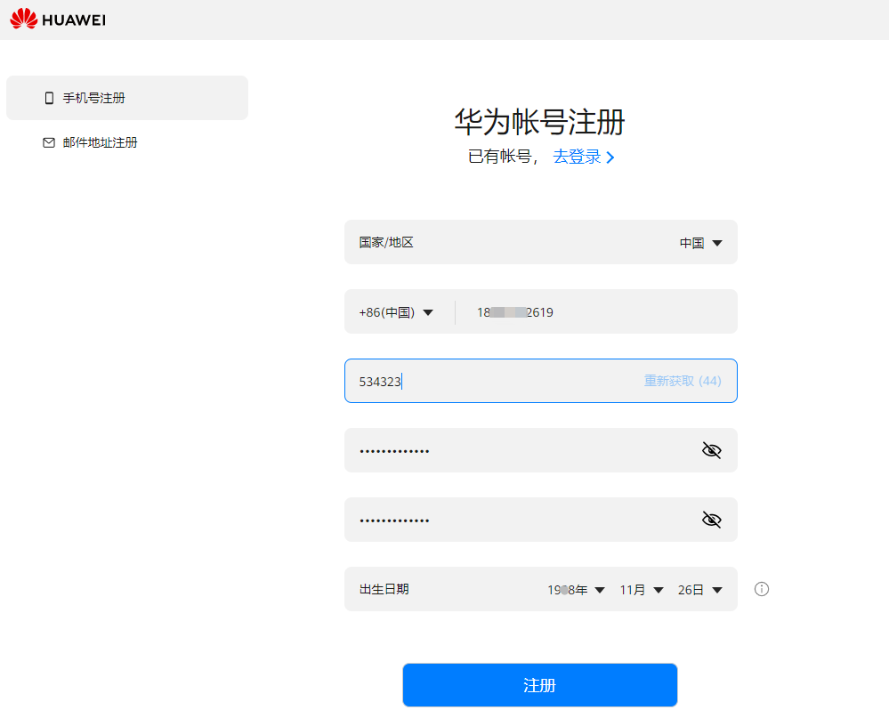
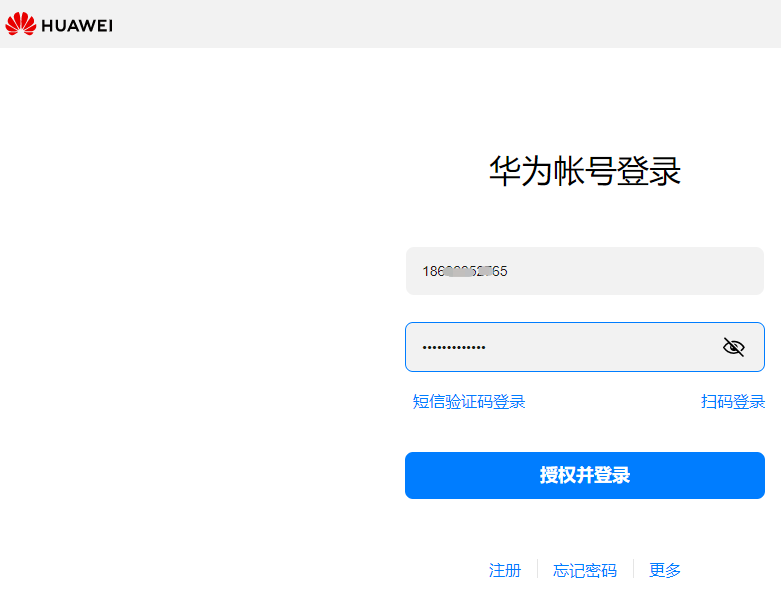
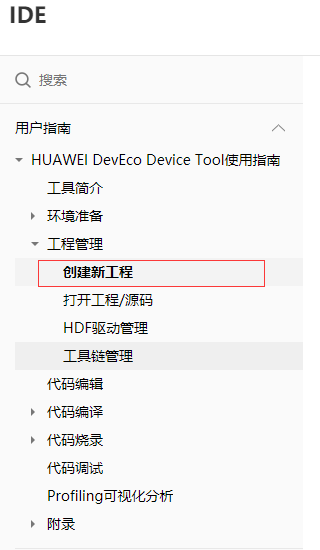

# 一、 准备工作
## 1.&emsp; 硬件准备（[点击购买](https://item.taobao.com/item.htm?ft=t&id=645216486457)）

- BearPi-HM Nano主板（[开发板介绍](https://gitee.com/bearpi/bearpi-hm_nano)）

- “护花使者”底板，即传感器底板，下述统一称“护花使者”底板

- 配套水泵（额外土壤湿度传感器选配）

- 排线两对

- 水管

- 螺丝刀 

&emsp;&emsp;&emsp;

- Type-C 电源线一根（套装不包含，需自备）

- 安装HarmonyOS或安卓系统的手机，且要具备NFC功能，当前不支持IOS系统（需自备）

- 4节7号电池，用于开发板供电，也可用Type-C供电。（需自备）

## 2.&emsp;软件准备

- HiBurn烧录工具路径：”vendor_oh_fun\bearpi-hm_nano-oh_flower/04_烧录工具/HiBurn.exe “

- PC 预装Windows系统

# 二、 快速上手

（必要章节）按该章节步骤操作完成之后，即可上手把玩。开发板是预烧录好的，无需烧录固件就可使用。
## 1.&emsp;注册开发者联盟帐号
&emsp;1.1&emsp;打开[华为基础服务文档中心](https://developer.huawei.com/consumer/cn/doc/start/registration-and-verification-0000001053628148)，点击“注册”，如图：

&emsp;&emsp; 

&emsp;1.2&emsp;根据手机号码注册为例，如图：

&emsp;&emsp; 

## 2.&emsp;下载IDE
&emsp;2.1&emsp;打开[下载IDE链接](https://device.harmonyos.com/cn/ide#download)，点击下载，如图：

&emsp;&emsp; 

&emsp;2.2&emsp;以下载linux版本为例，点击下载时候，会提示需要登录，输入刚才注册的帐号和密码，点击：“授权并登录”，如图：

&emsp;&emsp; 

&emsp;2.3&emsp;登录成功后，会显示登录信息，然后点击下载，如图：

&emsp;&emsp; 

## 3.&emsp;护花使者套件安装

### 3.1. 准备工作

&emsp;如下所列硬件准备完成后，请按照下述教程完成相关硬件连接。

- BearPi-HM Nano主板

- “护花使者”底板，即传感器底板，下述统一称“护花使者”底板

- 配套水泵（额外土壤湿度传感器选配）

- 排线两对

- 水管

- 螺丝刀 

&emsp;&emsp;&emsp;

- Type-C 电源线一根（套装不包含，需自备）

- 安装HarmonyOS或安卓系统的手机，且要具备NFC功能，当前不支持IOS系统（需自备）

- 4节7号电池，用于开发板供电，也可用Type-C供电。（需自备）

### 3.2. 将开发板和底板固定

&emsp;主板对准四个限位螺母，拧上螺丝即可固定主板，再用排线连接主板和传感器底板的两组排针。

&emsp;

&emsp;组装完成实物图。

&emsp;

### 3.3.	为开发板供电
- 在“护花使者”底板背部，装入4节7号电池。安装电池的时候，注意电池的正负极。
- 也可通过BearPi-HM Nano主板中标准的USB Type-C接口为开发板供电。

本文使用电池为开发板供电。

&emsp;

### 3.4. 连接水泵和开发板
&emsp;本套件背板搭载标准的USB Type-A接口，用于接入5V水泵，水将水泵和“护花使者”底板按照下图所示连接。

&emsp;

### 3.5.	启用套件
&emsp;准备一个蓄水的容器，用作浇花的水源，把水泵放入容器中，水管伸到花盆中，再将底板的探头部分插入土壤。

&emsp;

## 4.&emsp;小程序使用
### &emsp;4.1. 打开小程序

&emsp;&emsp;扫描二维码关注公众号，在下方菜单栏中打开小程序。
    

&emsp;&emsp;

### &emsp;4.2. 登录小程序

&emsp;&emsp;4.2.1. **登录小程序**

&emsp;&emsp;在小程序“我的”界面输入华为帐号名、IAM帐号名及密码。若没有华为帐号名、IAM帐号名及密码，请按照`“4.2.2. 获取华为帐号名、4.2.3 获取IAM帐号名及密码”`步骤进行。

&emsp;&emsp;

&emsp;&emsp;4.2.2. **获取华为帐号名**
    
&emsp;&emsp;（1）在电脑上使用华为帐号登录华为云[https://www.huaweicloud.com/](https://www.huaweicloud.com/)，若无华为帐号请自行注册华为帐号。

&emsp;&emsp;

&emsp;&emsp;（2）在右上角用户的帐号中心中**完成实名认证**，并点击进入帐号中心。
    
&emsp;&emsp;

&emsp;&emsp;（3）在帐号中心的基本信息中获取华为帐号名。

&emsp;&emsp;

&emsp;&emsp;4.2.3 **获取IAM帐号名及密码**

    
&emsp;&emsp;（1）在电脑上点击[https://console.huaweicloud.com/iam](https://console.huaweicloud.com/iam)，进入华为云统一身份认证服务。
    
&emsp;&emsp;（2）点击右上角"创建用户"。
    

&emsp;&emsp;

&emsp;&emsp;（3）填写新用户信息，此处填写的用户名及密码即为登录小程序所需的IAM帐号名及密码，并点击下一步。

&emsp;&emsp;

&emsp;&emsp;（4）选择加入的用户组，此处选择“拥有所有操作权限的用户组“，并点击右下角“创建用户”。

&emsp;&emsp;

&emsp;&emsp;**4.2.4 开通IoTDA服务**

&emsp;&emsp;点击[**开通IoTDA服务**](https://console.huaweicloud.com/iotdm/?region=cn-north-4#/dm-portal/home)后并登录即可开通IoTDA服务
，本实验需要使用的华为云IoTDA设备接入服务，设备的数据会先上传至IoTDA平台，再转至小程序。该服务针对开发者不收费，请知悉。

&emsp;&emsp;

### （注意：未开通IoTDA服务，小程序将无法添加设备）

### 4.3. 添加设备

&emsp;添加设备前请**打开手机的NFC及定位服务**功能，然后点击小程序右上角加号，添加设备，此时开发板上的LED灯闪烁。
    
&emsp;&emsp;**`注意事项：`**

- **`需要使用带NFC功能的手机，并打开NFC功能，许多旧款的手机及iPhone手机不带有此功能`**
- **`v0.1版本护花使者只能添加一个设备，添加一个设备后该“+”控件会失效`**
- **`过程中华为不涉及收集、留存、使用用户数据。`**

&emsp;&emsp;&emsp;       
 
### 4.4. 配置设备

&emsp;填写设备名称（自定义填写），以及设备连接目标WiFi的帐号和密码（可开启自身手机热点充当wifi进行简单测试），当提示“请将NFC模块靠近设备”时，**将手机NFC感应区（不同手机的NFC感应部位不同）靠近开发板的NFC天线处，此时NFC灯会亮，显示配置成功即可。**

&emsp;**`注意事项：`**
- **`此处指定接入的WiFi需要为2.4G的WiFi（一般为WiFi名字后缀不带5G字样的），且不能是开放的WiFi，也就是连接时需要输入密码的WiFi。`**

- **`也可在添加设备前将手机接入2.4G的WiFi，添加设备时会自动选择手机当前连接的WiFi。`**
- **`显示配置成功才算成功，若显示配置失败，需删除设备再次执行4.3-4.4操作步骤。`**
    
&emsp;&emsp; 

&emsp;
 
### 4.5. 调试设备

&emsp;添加完设备后，**按一下开发板的复位按键，等待开发板上的LED灯常亮后，在小程序界面下拉刷新，等待设备上线**，设备上线后点击设备，打开设备详情界面，即可查看当前绿植的土壤湿度以及空气的温湿度，点击浇水按钮即可远程控制设备浇水。
  
  **注：设备上线后，手机使用移动数据也能远程监控设备数据及控制浇水。**

&emsp;   

&emsp;

至此，我们已经完成了护花使者的DIY，对代码感兴趣的小伙伴可以继续探索固件升级。

# 三、固件升级指导
（可选章节）快速上手之后，如果需要升级固件，请按照本章流程操作。下面为大家简单介绍一下OpenHarmony +小熊派HM Nano开发板升级烧录步骤：

## 1.&emsp;注册Gitee帐号
&emsp;1.1.&emsp;打开网址：https://gitee.com/ 点击注册，如图

&emsp;&emsp; 

&emsp;1.2.&emsp;发送验证码：

&emsp;&emsp; 
 
&emsp;1.3&emsp;填写验证码和密码后，点击“立即注册”，如图：

&emsp;&emsp; 
 
&emsp;1.4.&emsp;注册成功，如图：

&emsp;&emsp; 
 
## 2.&emsp;点赞

&emsp;打开以下链接，给该项目点赞，效果如下图所示：
https://gitee.com/openharmony-sig/vendor_oh_fun/tree/master/bearpi-hm_nano-oh_flower

&emsp; 

&emsp;快速上手之后，如果需要升级固件，请按照本章流程操作。下面为大家简单介绍一下OpenHarmony+小熊派HM Nano开发板升级烧录步骤：

## 3.&emsp;下载开发板程序

&emsp;3.1&emsp;打开如下链接，可进入Gitee源码仓：
链接：
https://gitee.com/openharmony-sig/vendor_oh_fun/tree/master/bearpi-hm_nano-oh_flower

&emsp;3.2&emsp; 克隆/下载处，点击下载ZIP，如图：

&emsp;&emsp;

&emsp;3.3&emsp; 解压“openharmony-sig-vendor_oh_fun-master.zip”文件，进入“bearpi-hm_nano-oh_flower”文件夹，获得以下文件

&emsp;&emsp;

## 4.&emsp;安装驱动

&emsp;BearPi-HM_Nano开发板可以使用USB烧录代码及打印调试日志，但使用前需要在电脑上安装相应的驱动，所以下面我们就来看看怎么安装驱动。

&emsp;4.1&emsp; 通过TypeC数据线，把电脑与BearPi-HM Nano连接。
    
&emsp;4.2&emsp; 双击打开“02_USB驱动“文件夹下的”CH341SER.EXE“文件，并点击安装，驱动安装成功将如下图所示。

&emsp;&emsp;

&emsp;注：若提示“安装失败”，请点击“卸载”，再点击“安装”

&emsp;4.3&emsp;	打开电脑设备管理器，查看开发板的连接的端口，该端口用于后续烧录代码及打印调试日志使用。
 
&emsp;&emsp;

## 5.&emsp;烧录程序

### IDE工具烧录
1. 按照[官方教程](https://device.harmonyos.com/cn/docs/ide/user-guides/install_windows-0000001050164976)在Windows下安装IDE工具。

    注意：目前仅支持在Windows环境下烧录。

&emsp;&emsp;&emsp;   
 
2. 任意路径下新创建一个文件夹，并放入要烧录的文件。

&emsp;&emsp;&emsp;   
 

3. 打开VScode，点击左边的IDE工具，后点击Open DecEco Project。 

&emsp;&emsp;&emsp;   
 
4. 打开刚刚创建的文件夹路径。 

&emsp;&emsp;&emsp;   

&emsp;&emsp;&emsp;    

5. Board选择BearPi-HM Nano，然后点击Open。

&emsp;&emsp;&emsp;   

6. 配置端口和烧录协议

&emsp;&emsp;&emsp;   

7. 配置烧录文件路径

&emsp;&emsp;&emsp;   

&emsp;&emsp;&emsp;   
 

8. 配置路径好后，点击保存，后点击打开。

&emsp;&emsp;&emsp;   

9. 点击左边的IDE图标，后点击Upload开始烧录，在板子上按下reset键即可开始烧录。
 

&emsp;&emsp;&emsp; 

&emsp;&emsp;&emsp;     

10. 显示SUCCESS表示烧录成功，再按下板子上的reset键就可以运行了

&emsp;&emsp;&emsp;    

### Hiburn工具烧录    
&emsp;烧写工具用于为可编程的集成电路写上数据，要实现开发板程序烧写。本次给BearPi-HM Nano开发板烧写二进制镜像文件工具是 HiBurn，接下来让我们来看一下怎么使用HiBurn工具给开发板烧录程序。

1. 打开“04_烧录工具”文件下的“HiBurn.exe”工具，并点击Refresh，在COM中选择上一步看到的COM号。然后点击Setting，并选择 Com settings。

&emsp;&emsp;&emsp;

2. 在Com settings中设置Baud为：921600（代表该串口的烧录速率），点击确定。

&emsp;&emsp;&emsp;

3. 点击 Hiburn工具中的Select file按钮，在弹出的文件框中，选择“03_固件”文件下的OpenHarmony_flower_V0.1 文件。

&emsp;&emsp;&emsp;

4. 点击Auto burn复选框，然后点击Connect，此时Connect按钮变成Disconnect，等待下载。

&emsp;&emsp;&emsp;

5. 复位开发板RESET按键，开始下载程序。

&emsp;&emsp;&emsp;

&emsp;&emsp;&emsp;
    
6. 直到出现Execution Successful字样，程序下载完成。

&emsp;&emsp;&emsp;

7. 下载完后，点击Disconnect按钮，否则再次按下复位键后会重新开始烧录代码。

&emsp;&emsp;&emsp;

至此，我们已经完成了所有烧录操作，大家是不是对于如何使用OpenHarmony+小熊派HM Nano开发板制作“护花使者”有了进一步了解，实际上还可以将OpenHarmony+小熊派HM Nano开发板改造成宠物自动喂食器，水浸报警器，水位检测器等，也期待开发者们能发掘OpenHarmony+小熊派HM Nano开发板新玩法！在不久的将来，我们将持续升级，带来更多好玩有趣的内容，让开发者以更少的时间和更低的成本玩转OpenHarmony+小熊派开发板开发板，敬请期待啦！

# 四、	开发环境（IDE）使用说明
（可选章节）使用IDE进行源码编译就简便得多，若想进行源码下载及编译的小伙伴可以参照本章节进行操作

## 1.	Ubuntu开发环境准备

&emsp;&emsp;1.1	打开IDE用户指南链接：[用户指南-Ubuntu开发环境准备 (harmonyos.com)](https://device.harmonyos.com/cn/docs/ide/user-guides/install_ubuntu-0000001072959308)，护花使者的代码是在Linux环境下编译的，所以我们要选择在Ubuntu下安装IDE工具，如图：
 

  &emsp;&emsp;&emsp;

&emsp;&emsp;1.2	按照开发环境要求，我们需要Ubuntu 18以上的版本（虚拟机和Ubuntu自行安装）以及[相关的工具](https://device.harmonyos.com/cn/docs/ide/user-guides/install_ubuntu-0000001072959308)，根据获取渠道进行下载（注意：各软件版本要求），如图：

 &emsp;&emsp;&emsp;

&emsp;&emsp;1.3	打开Ubuntu->终端，根据下图步骤将Ubuntu shell改为bash，如图：

&emsp;&emsp;&emsp;

&emsp;&emsp;1.4	之后根据[官方步骤](https://device.harmonyos.com/cn/docs/ide/user-guides/install_ubuntu-0000001072959308)依次安装python, Node.js, Hpm, Visual Studio Code和DevEco Device Tool即可，到此开发环境安装完毕，如图：

 &emsp;&emsp;&emsp;
 
## 2.	安装编译工具链
&emsp;&emsp;2.1	选择[Ubuntu平台安装编译工具链](https://device.harmonyos.com/cn/docs/ide/user-guides/ubuntu_code_build-0000001147590217)，如图：

&emsp;&emsp;&emsp;

&emsp;&emsp;2.2	下载[Hi3861系列的编译工具链](https://device.harmonyos.com/cn/docs/ide/user-guides/ubuntu_code_build-0000001147590217)，如图：

&emsp;&emsp;&emsp;

**注意：下载riscv32-gcc时，点击直接下载镜像**，如图：

&emsp;&emsp;&emsp;

&emsp;&emsp;2.3	输入vim ~/.bashrc，如图：

&emsp;&emsp;&emsp;

&emsp;&emsp;2.4	参考下图，设置环境变量，根据gn、ninja、llvm、gcc_riscv32这四个工具的实际安装路径，根据下图，将路径替换掉即可：

 &emsp;&emsp;&emsp;

&emsp;&emsp;2.5	生效环境变量，输入source ~/.bashrc，如图：

&emsp;&emsp;&emsp;

&emsp;&emsp;2.6	输入riscv32-unknown-elf-gcc –v，如果能正确显示编译器版本号，表明编译器安装成功。，如图：

&emsp;&emsp;&emsp;

## 3.	创建工程/下载源码
&emsp;&emsp;3.1	创建[一个新的工程](https://device.harmonyos.com/cn/docs/ide/user-guides/create_project-0000001072200151)，如图：

&emsp;&emsp;&emsp;

&emsp;&emsp;3.2	在projects中创建工程，如图：

&emsp;&emsp;&emsp;

&emsp;&emsp;3.3	自定义工程名，芯片型号选择Hi3861，如图：

&emsp;&emsp;&emsp;

&emsp;&emsp;3.4	选择project，就可以看到刚刚创建的工程，如图：

&emsp;&emsp;&emsp;

&emsp;&emsp;3.5	选择HPM源码，下载源码到工程（注意：别选错HPM源码），开始安装，如图：

&emsp;&emsp;&emsp;

&emsp;&emsp;&emsp;

&emsp;&emsp;3.6	安装完毕，点击Close关闭，如图：

&emsp;&emsp;&emsp;

## 4.	源码编译
&emsp;&emsp;4.1	源码安装完成后，根据下图步骤操作，点击Build之后，开始编译，如图：

&emsp;&emsp;&emsp;

&emsp;&emsp;4.2	显示SUCCESS表示编译成功，如图：

&emsp;&emsp;&emsp;

&emsp;&emsp;4.3	编译完成后，产生二进制文件如下图所示，将其移到windows环境下用Hiburn工具烧录即可，如图：
 

&emsp;&emsp;&emsp;